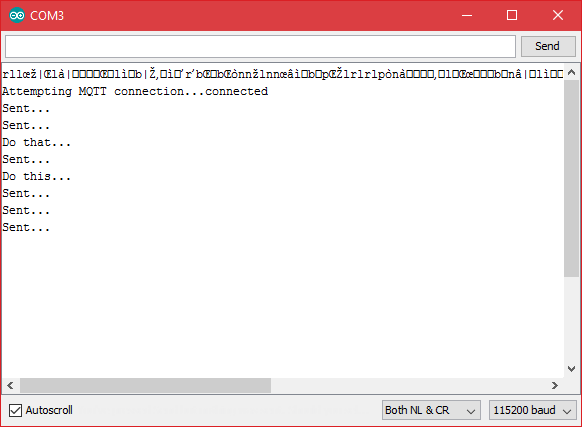
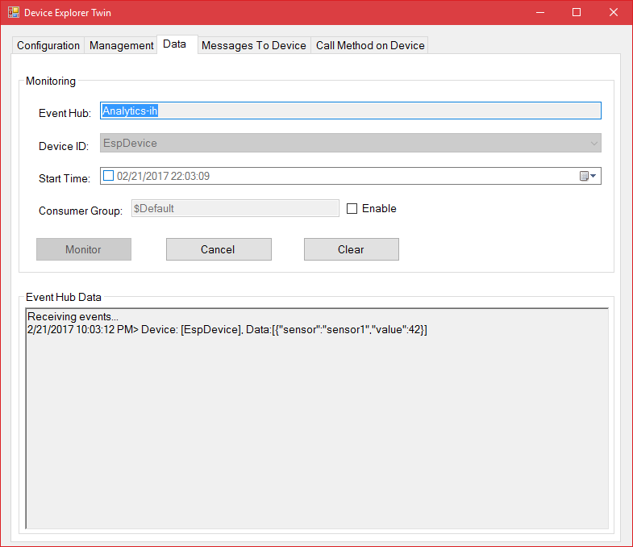
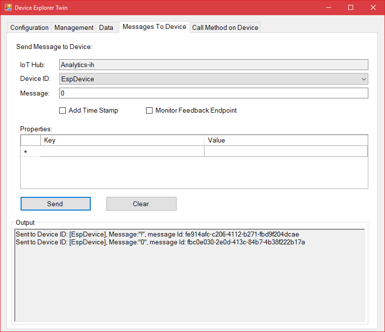

This library supports a more generic access to Azure IoT Hub:

1. Send D2C telemetry using your own favorite JSON formatter
2. Accept C2D commands in a byte array format
3. Integrate better in the Arduino IDE

*Sending telemetry and receiving commands*

1. Open the example sketch named _Azure-iothub-generic-esp8266.ino_
2. Fill in the network SSID and password
3. Fill in the already generated IoTHub Connection string for your device
4. Compile and upload the sketch to your device
5. After uploading, open the serial monitor and see how messages are sent

    

6. In the IoTHub Device Explorer, the messages are picked up

    

7. Try to send commands using the IoTHub Device Explorer. Send a '!' or a '0'

    
	
Now you are sending telemetry and receiving commands.
	
*Referenced Json libraries*	
	
The example sketch in this library is referencing 'ArduinoJson.h'.
	
*License*	
	
This code is released under the MIT License.

